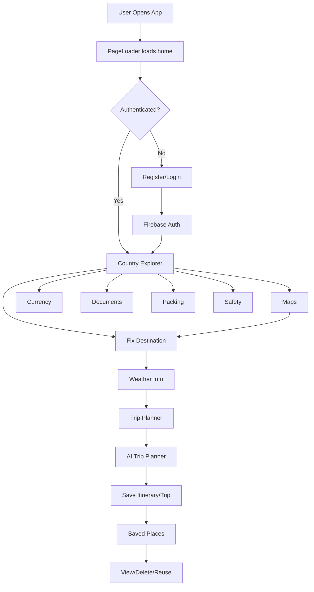
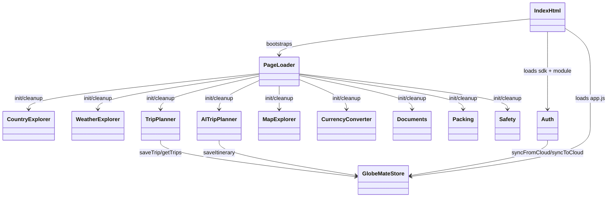
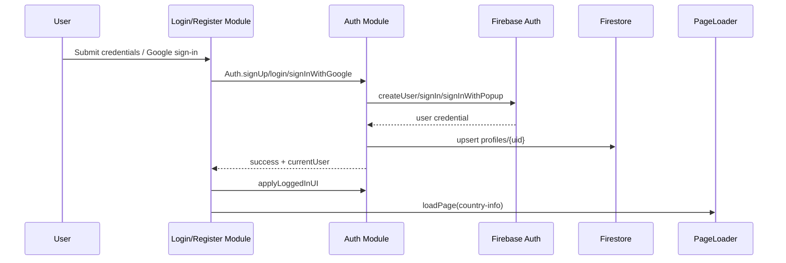
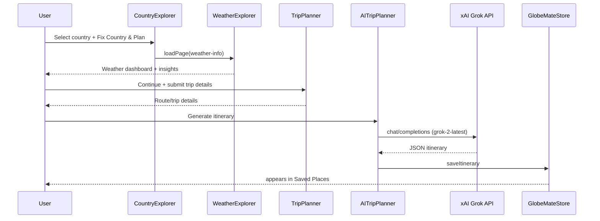
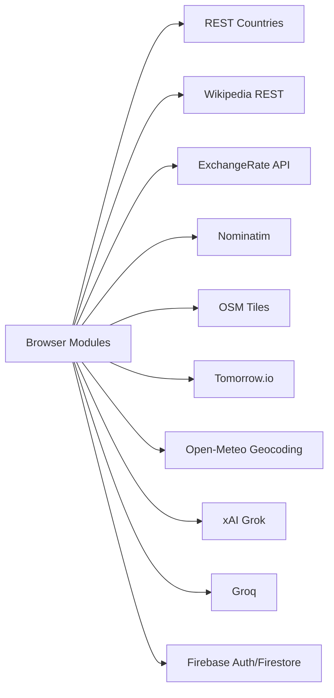

# GlobeMate — Smart Travel Companion

GlobeMate is a modular vanilla JavaScript travel web app that uses SPA-style page loading, Firebase authentication, weather intelligence, maps/geocoding, country intelligence, and AI-assisted itinerary generation.

## 1. End-to-End Workflow



## 2. UML Diagrams

### 2.1 UML Component Diagram



### 2.2 UML Sequence — Authentication Flow



### 2.3 UML Sequence — Destination to AI Itinerary



## 3. Runtime Architecture

### 3.1 SPA Runtime Flow

1. `index.html` loads core scripts and page modules.
2. `PageLoader.init()` sets up global click handling for `[data-tab]`.
3. On navigation, `PageLoader.loadPage(pageId)` fetches `pages/{pageId}.html`.
4. Current module `cleanup()` runs, then new module `init()` runs.
5. Body classes and nav active state are updated.

### 3.2 Data Layers

- UI state and feature data: browser memory + `localStorage`
- Auth/session: Firebase Auth persistence (IndexedDB managed by Firebase SDK)
- Cloud sync: Firestore (`profiles` and `user_saved_places` usage)

## 4. Project Structure

```text
Globemate2/
├── index.html
├── README.md
├── IMAGE_REFERENCES.md
├── .gitignore
├── css/
│   └── styles.css
├── js/
│   ├── animations.js
│   ├── app.js                      # utilities + GlobeMateStore cloud/local sync
│   ├── auth.js                     # Firebase Auth + Firestore gateway
│   ├── config.js                   # public-safe defaults
│   ├── config.local.example.js     # local key template
│   ├── config.local.js             # local private keys (git-ignored)
│   ├── country-info.js             # country search/details + weather handoff
│   ├── currency.js                 # exchange rate conversion
│   ├── documents.js
│   ├── home.js
│   ├── login.js
│   ├── maps.js                     # map search/reverse geocode + destination set
│   ├── packing.js
│   ├── page-loader.js              # SPA page loader/router
│   ├── register.js
│   ├── safety.js
│   ├── trip-ai-planner.js          # Grok itinerary + follow-up assistant
│   ├── trip-planner.js
│   └── weather.js                  # weather dashboard + AI weather assistant
└── pages/
  ├── country-info.html
  ├── currency.html
  ├── documents.html
  ├── home.html
  ├── login.html
  ├── maps.html
  ├── packing.html
  ├── register.html
  ├── safety.html
  ├── saved-places.html
  ├── trip-ai-planner.html
  ├── trip-planner.html
  └── weather-info.html
```

## 5. API Integration Map



## 6. All API Integrations (Detailed)

| API / Service | Endpoint(s) Used | Module(s) | Trigger | Purpose | Auth/Key |
|---|---|---|---|---|---|
| Firebase Auth | SDK methods: `createUserWithEmailAndPassword`, `signInWithEmailAndPassword`, `signInWithPopup`, `signOut`, `onAuthStateChanged` | `js/auth.js` | register/login/logout/session-check | user authentication & session | Firebase config |
| Cloud Firestore | `profiles/{uid}`, `user_saved_places/{uid}` via SDK | `js/auth.js`, `js/app.js` | post-auth, save/sync trips | profile + saved places cloud sync | Firebase config |
| REST Countries | `https://restcountries.com/v3.1/all?fields=...` | `js/country-info.js` | country module init | load country master dataset | none |
| REST Countries | `https://restcountries.com/v3.1/name/{query}?fields=name,flags,cca3` | `js/trip-planner.js` | host country search | autocomplete/search | none |
| REST Countries | `https://restcountries.com/v3.1/name/{country}?fullText=true&fields=...` and fallback `.../name/{country}?fields=...` | `js/maps.js` | set destination from map | metadata enrichment for selected country | none |
| Wikipedia REST | `https://en.wikipedia.org/api/rest_v1/page/summary/{country}` (+ tourism fallback) | `js/country-info.js` | country selected | history/culture summaries | none |
| Exchange Rate API | `https://api.exchangerate-api.com/v4/latest/USD` | `js/currency.js` | currency module init | currency rates for conversions | none |
| Nominatim Search | `https://nominatim.openstreetmap.org/search?...` | `js/maps.js` | map search input | forward geocoding | none |
| Nominatim Reverse | `https://nominatim.openstreetmap.org/reverse?...` | `js/maps.js`, `js/trip-planner.js` | map click / detect location | reverse geocoding city/country | none |
| OpenStreetMap Tiles | `https://{s}.tile.openstreetmap.org/{z}/{x}/{y}.png` | `js/maps.js` | map init | render map tiles | none |
| Tomorrow.io Realtime | `https://api.tomorrow.io/v4/weather/realtime?...` | `js/weather.js` | weather load/refresh | current weather + air-quality related values | `TOMORROW_IO_API_KEY` |
| Tomorrow.io Forecast | `https://api.tomorrow.io/v4/weather/forecast?...` | `js/weather.js` | weather load/refresh | daily forecast data | `TOMORROW_IO_API_KEY` |
| Tomorrow.io History | `https://api.tomorrow.io/v4/weather/history/recent?...` | `js/weather.js` | weather load | climate trend baseline | `TOMORROW_IO_API_KEY` |
| Open-Meteo Geocoding | `https://geocoding-api.open-meteo.com/v1/search?...` | `js/weather.js` | weather load (destination resolve) | coordinates for weather calls | none |
| xAI Grok (itinerary) | `https://api.x.ai/v1/chat/completions` (`grok-2-latest`) | `js/trip-ai-planner.js` | itinerary generate/follow-up | structured itinerary + answers | `GROK_API_KEY` |
| xAI Grok (weather insight) | `https://api.x.ai/v1/chat/completions` (`grok-2-latest`) | `js/weather.js` | insight enrichment | traveler-friendly weather insights JSON | `GROK_API_KEY` |
| Groq | `https://api.groq.com/openai/v1/chat/completions` (`llama-3.1-8b-instant`) | `js/weather.js` | weather AI chat | Q&A assistant in weather panel | `GROQ_API_KEY` |
| Unsplash image CDN | `https://images.unsplash.com/...` | `js/country-info.js`, `js/weather.js` | render country/place/weather hero visuals | UI media | none |
| FlagCDN | `https://flagcdn.com/{code}.svg` | `js/country-info.js` fallback | fallback flags | fallback imagery | none |

## 7. Process Steps (Every Major Flow)

### 7.1 App Bootstrap Process

1. Browser loads `index.html`.
2. Config scripts load (`js/config.js`, then `js/config.local.js`).
3. Core scripts load (`js/app.js`, `js/animations.js`, `js/page-loader.js`, modules).
4. `Auth.initFirebase()` runs.
5. `Auth.checkSession()` resolves current user state.
6. `PageLoader` loads `home` by default.

### 7.2 Authentication Process

1. User submits register/login.
2. `Auth` calls Firebase Auth SDK.
3. On success, `currentUser` is set and UI nav updates.
4. Firestore profile upsert runs (non-blocking).
5. Cloud saved-places pull can run for authenticated user.
6. App navigates to `country-info`.

### 7.3 Country -> Weather -> Trip Process

1. `country-info` loads countries from REST Countries.
2. User selects country and clicks “Fix Country & Plan Trip”.
3. Destination is stored in `localStorage` (`globemate_trip_destination`).
4. App navigates to `weather-info`.
5. Weather module resolves coordinates via Open-Meteo Geocoding.
6. Weather module fetches realtime + forecast + history from Tomorrow.io.
7. Dashboard renders; user continues to `trip-planner`.
8. Trip details are entered and saved for next steps.

### 7.4 AI Itinerary Generation Process

1. User opens `trip-ai-planner` and completes preference prompts.
2. Module builds structured trip context.
3. If `GROK_API_KEY` exists, request goes to xAI (`grok-2-latest`) for strict JSON itinerary.
4. Response is normalized and validated.
5. If AI fails/missing key, local fallback itinerary logic is used.
6. Final itinerary is rendered and can be saved.

### 7.5 Weather AI Assistant Process

1. Weather snapshot builds context brief.
2. For quick Q&A, module can use Groq endpoint when `GROQ_API_KEY` exists.
3. For card enrichment JSON, module can use Grok endpoint when `GROK_API_KEY` exists.
4. UI updates insight cards/chat responses.
5. Graceful fallback keeps weather data visible even if AI calls fail.

### 7.6 Saved Places and Cloud Sync Process

1. Save action writes normalized entry to `GlobeMateStore`.
2. Data is stored in local keys (saved places + legacy compatibility keys).
3. Update event `globemate:saved-places-updated` is dispatched.
4. Debounced cloud push writes to Firestore `user_saved_places/{uid}`.
5. On login/init, cloud pull merges local and cloud entries by recency.

### 7.7 Maps “Set as Destination” Process

1. User searches or clicks on map.
2. Reverse geocode resolves city/country via Nominatim.
3. REST Countries lookup enriches metadata (flag/capital/region).
4. Destination + prefill are stored in `localStorage`.
5. App routes to `weather-info` for weather-first planning.

## 8. Configuration

### 8.1 Public-safe Defaults

`js/config.js` includes empty defaults:

- `window.FIREBASE_CONFIG`
- `window.TOMORROW_IO_API_KEY`
- `window.GROK_API_KEY`
- `window.GROQ_API_KEY`

### 8.2 Local Private Config

1. Copy `js/config.local.example.js` to `js/config.local.js`
2. Fill private keys locally
3. `js/config.local.js` is ignored by git

## 9. Setup

1. Clone repository
2. Configure local keys
3. Start local server:

```bash
python -m http.server 8000
```

4. Open `http://localhost:8000`

## 10. Notes

- Architecture is static frontend (no bundler required).
- API failures have graceful fallback behavior in most modules.
- Secrets must remain in local config only.

## License

MIT
