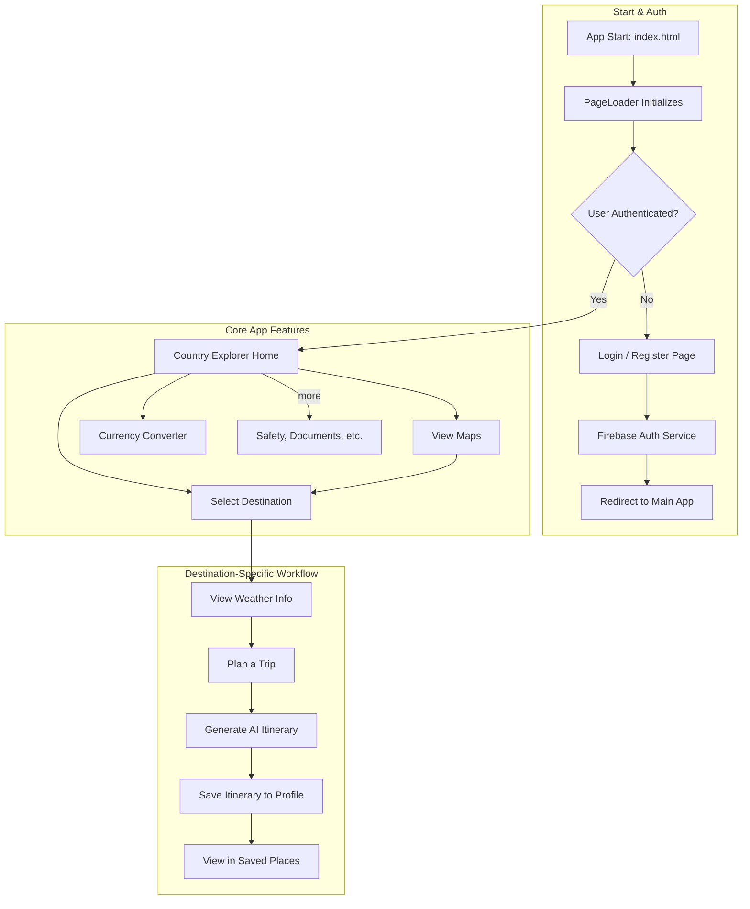

# GlobeMate Project Architecture

This document provides an overview of the GlobeMate application's workflow, technical methodologies, and API integrations.

## 1. Project Workflow

The application follows a modular Single Page Application (SPA) structure. The user journey is managed by a central page loader that handles authentication and navigation.

## 2. Methodologies Used

The project is built with a focus on modern, framework-less web technologies, emphasizing modularity and maintainability.

-   **Architecture**: **Single Page Application (SPA)**. A custom router (`js/page-loader.js`) dynamically loads different HTML pages (`/pages/*.html`) into the main `index.html` without full page reloads, creating a fluid user experience.

-   **UI & Frontend Logic**: **Vanilla JavaScript (ES6 Modules)**. The entire frontend is built without a major framework like React or Vue. Code is organized into modular JavaScript files (`/js/*.js`) that encapsulate specific features (e.g., `weather.js`, `maps.js`). This approach keeps the project lightweight and avoids framework-specific overhead.

-   **State Management**: **Centralized Data Store (`GlobeMateStore`)**. A custom store object in `js/app.js` acts as a single source of truth for critical user data like saved trips and itineraries. It manages:
    -   **Local Persistence**: Caching data in the browser's `localStorage`.
    -   **Cloud Sync**: Automatically synchronizing data with the user's Firestore document.
    -   **Data Normalization**: Ensuring consistent data structures across the application.

-   **Backend & Database**: **Firebase (Backend-as-a-Service)**. Firebase provides a scalable and secure backend for:
    -   **Authentication**: Manages user sign-up, login (Email/Password, Google OAuth), and session persistence.
    -   **Cloud Firestore**: A NoSQL database used to store user profiles and sync saved places/trips across devices.

-   **API Integration**: The application is a rich client that orchestrates calls to numerous third-party APIs. Each integration is isolated within its relevant module. API keys and sensitive configurations are managed separately in `config.local.js` (which is git-ignored) to keep them out of source control.

-   **AI Integration**: **Large Language Models (LLMs)** are used to provide intelligent features:
    -   **xAI Grok**: Generates structured travel itineraries based on user input.
    -   **Groq**: Powers a conversational AI assistant for weather-related questions.

## 3. API Calls and Endpoints

### Firebase Auth + Firestore
- Where integrated:
  - `js/auth.js`
  - `js/app.js` (saved places cloud sync)
- Endpoints/API style:
  - Firebase SDK methods (`createUserWithEmailAndPassword`, `signInWithEmailAndPassword`, `signInWithPopup`, `signOut`, `onAuthStateChanged`)
  - Firestore documents: `profiles/{uid}`, `user_saved_places/{uid}`
- Function:
  - Handles login/session state
  - Stores user profile data
  - Syncs saved places between local and cloud

### REST Countries API
- Where integrated:
  - `js/country-info.js`
  - `js/trip-planner.js`
  - `js/maps.js`
- Endpoints:
  - `https://restcountries.com/v3.1/all?fields=...`
  - `https://restcountries.com/v3.1/name/{query}?fields=name,flags,cca3`
  - `https://restcountries.com/v3.1/name/{country}?fullText=true&fields=...`
- Function:
  - Loads country dataset
  - Powers search/autocomplete
  - Enriches destination metadata (flag/capital/region)

### Wikipedia REST API
- Where integrated:
  - `js/country-info.js`
- Endpoint:
  - `https://en.wikipedia.org/api/rest_v1/page/summary/{country}`
- Function:
  - Fetches country history/culture summary for selected destination

### Tomorrow.io Weather API
- Where integrated:
  - `js/weather.js`
- Endpoints:
  - `https://api.tomorrow.io/v4/weather/realtime?...`
  - `https://api.tomorrow.io/v4/weather/forecast?...`
  - `https://api.tomorrow.io/v4/weather/history/recent?...`
- Function:
  - Provides realtime weather, forecast trend, and recent historical climate data

### Open-Meteo Geocoding API
- Where integrated:
  - `js/weather.js`
- Endpoint:
  - `https://geocoding-api.open-meteo.com/v1/search?...`
- Function:
  - Resolves destination name to coordinates before weather calls

### Nominatim (OpenStreetMap) Geocoding API
- Where integrated:
  - `js/maps.js`
  - `js/trip-planner.js`
- Endpoints:
  - `https://nominatim.openstreetmap.org/search?...`
  - `https://nominatim.openstreetmap.org/reverse?...`
- Function:
  - Forward geocoding for search
  - Reverse geocoding for map click/current location
  - Supports set-destination workflow

### OpenStreetMap Tile Server
- Where integrated:
  - `js/maps.js`
- Endpoint pattern:
  - `https://{s}.tile.openstreetmap.org/{z}/{x}/{y}.png`
- Function:
  - Renders map tiles inside Leaflet map

### Exchange Rate API
- Where integrated:
  - `js/currency.js`
- Endpoint:
  - `https://api.exchangerate-api.com/v4/latest/USD`
- Function:
  - Fetches currency rates used for conversion logic
  - Falls back to local predefined rates on failure

### xAI Grok API
- Where integrated:
  - `js/trip-ai-planner.js`
  - `js/weather.js`
- Endpoint:
  - `https://api.x.ai/v1/chat/completions`
- Function:
  - Generates structured AI itinerary (trip planner)
  - Enhances weather insights with AI summaries

### Groq API
- Where integrated:
  - `js/weather.js`
- Endpoint:
  - `https://api.groq.com/openai/v1/chat/completions`
- Function:
  - Handles weather assistant Q&A responses

### Image/CDN Sources
- Where integrated:
  - `js/country-info.js`
  - `js/weather.js`
- Endpoints:
  - `https://images.unsplash.com/...`
  - `https://flagcdn.com/{code}.svg`
- Function:
  - Country/place visuals and flag fallbacks
